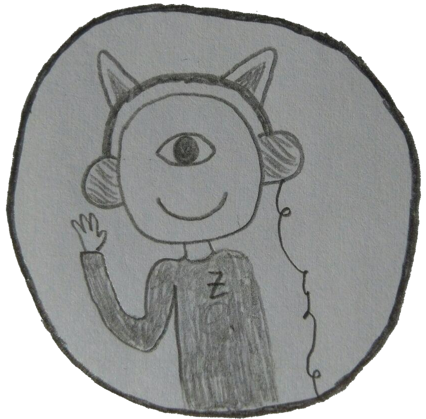

#  Hex - a personal music library
> "He was spending more nights now watching Hex trawl the invisible writings for any hints. In theory, because of the nature of L-space, absolutely everything was available to him, but that only meant that it was more or less impossible to find whatever it was you were looking for, which is the purpose of computers."
>
> &mdash; <cite>Terry Pratchett (in The Last Continent)</cite>

Hex is a collection of crates which can store, manage, tokenise and play music. It was born out of the desire to be independent from any music provider and to support music tokens (real world objects like CDs representing a playlist). The project is written in Rust and at the moment running on two platforms, a music server and player.

*What is the motivation for this project?*
 * having a music server running on a Raspberry Pi
 * proper support for a text interface as well as a web interface
 * a substitute for objects (e.g. CD) with tokens

*Of which parts is Hex made of?*
 * [database](database/) library - interface to a SQLite database
 * [music-container](music-container/) library - music codec with Opus and Spherical Harmonics
 * [sync](sync/) library - replicate database between peers (e.g. server and end device)
 * [server](server) binary - a HTTP and websocket server providing all the necessary calls
 * [frontend](frontend) website - nice GUI for music management
 * [cli](cli) binary - local management of the music collection without any server
 * [zyklop](zyklop) binary - music playing system with support for tokens in conjunction with a server
 * [nightly-worker](nightly-worker) binary - summarize each day and perform some kind of cleanup

*Can you give me a rough overview?*

The Hex project is all about music and its very important for us to have a acessible and easy user experience. For a developer this means that the project is chunked into useful components. The server plays the role of providing the music to every client with help of the `database` and `music-container` crates. The `database` crate defines objects like _Playlist_, _Track_, _Token_, etc. and provides useful functions to manage them in a SQLite database. The `music-container` converts raw audio to the Hex specific audio format. Two important points are that is uses the Opus codec to achieve good compression levels and saves the audio in a Spherical Harmonic format (though only minimal support at the moment, but extendable and backward compatible). With help of those libraries the server offers JSON calls to modify the database, play and swallow music. It can also provide the `frontend` with help of a HTTP server. The `frontend` connects to the websocket server and gives a nice overview and some tools to manage the music. The second streaming client (working with websockets too) is the `stream-client` which supports tokens and runs on a small ARM chip with four buttons and the MFRC522 reader. The `local-client` is a handy tool to manage the database without the graphical burden of a frontend. It can add music, change metadata and list information about Hex. As a local client it can only be used on the same computer as the server.

*How can I start to use Hex?*

As a user you should start by [installing](http://rust-lang.org/install.html) Rust and compiling the [server](server). It should pull in all necessary libraries. Then you can define the configuration as described there. This gives you a webinterface to manage your music, download, upload and play it. I'm using a `systemd` job to start the [nightly-worker](nightly-worker/) every night. If you want to use the [stream-client](stream-client/) and start using tokens, then please contact me, we built a prototype with a [chip](getchip.com) and used a MFC522 reader to read out the tokens.

*Will Hex support my file format in the futures?*

Please consider that the goal of Hex is not a general purpose audio player, but to provide a music library. For this we don't support any audio files, only storing to and retrieving audio from Hex. The file format is irrelevant and can be choosen as long as `ffmpeg` supports it.

*Can you explain the concept of tokens?*

In my childhood I had a lot of audio tapes and CDs, they were very convenient to put somewhere and to use at wish. I didn't have to stare at a computer screen or learn some complicated GUI structure. Just put them in the audio player and listen to music. With the emergence of streaming service this changed a lot. I have now to scroll through a list of playlists and the physical remebrance of a particular playlist is missing for me. In my opinion no computer interface can replace the way an object helps your brain to remember the associated content. 

So we changed the idea of a tape a little bit and are using now NFC tags encapsulated by a small wodden block to put a sticker on it. They can be stacked and put into a player which immediately starts to play the associated playlist. One nice thing is that the play/stop button are not needed anymore, because just removing the token pauses the music and saves the position.

*Is there a text interface available?*

This is planned and has a high priority. For now I'm trying to fix more important bugs and get the existing system working without problems.

## License

Licensed under either of

- Apache License, Version 2.0, ([LICENSE-APACHE](LICENSE-APACHE) or <http://www.apache.org/licenses/LICENSE-2.0>)
- MIT license ([LICENSE-MIT](LICENSE-MIT) or <http://opensource.org/licenses/MIT>)

at your option.

## Contribution
If you have any question or suggestion please just open an issue in Github. Feel free to comment on particular features or suggest crazy, funny ideas. I would anticipate if you can have some use of Hex and improve it at the same time.

Unless you explicitly state otherwise, any contribution intentionally submitted for inclusion in the work by you, as defined in the Apache-2.0 license, shall be dual licensed as above, without any additional terms or conditions.

## Future direction

There are a lot of changes going on right now and I'm trying to improve the frontend and backend quality in several ways:
 * introduce proper support for people and playlist images in the frontend
 * have full Spherical Harmonic support and give some examples out
 * improve speed and memory usage of the compression algorithm
 * draw icons for instruments and put them to the frontend
 * more MUSIC!
